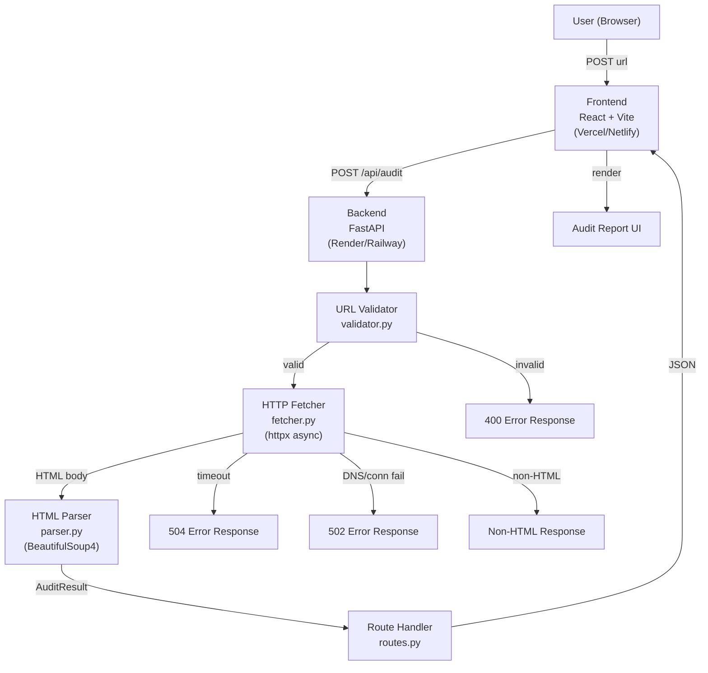
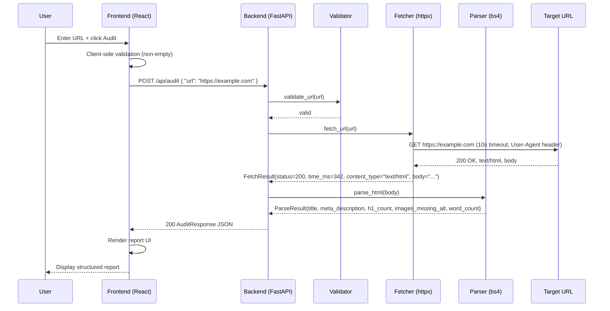
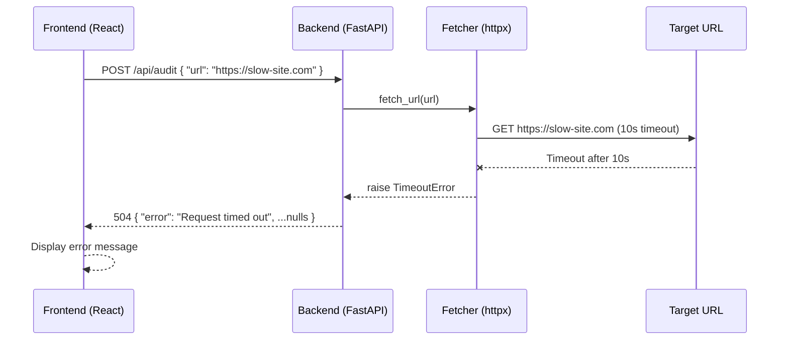
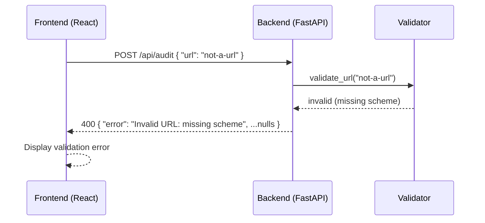

# Design Document: Page Pulse — URL Audit Tool

## Overview

Page Pulse is a production-quality full-stack web application that accepts a URL from a user and returns a structured SEO and quality audit report. The backend, built with Python and FastAPI, fetches the target page, measures performance metrics, and parses the HTML for common SEO signals. The frontend, built with React (Vite), presents the report in a clean, human-readable interface with color-coded status indicators.

The system is designed as a monorepo with `/backend` and `/frontend` directories, deployable independently — backend to Render/Railway and frontend to Vercel/Netlify. The architecture prioritizes separation of concerns: URL validation, HTTP fetching, HTML parsing, and route handling are each isolated into dedicated modules.

The primary user flow is intentionally simple: enter a URL, click Audit, receive a detailed report. Error states (timeouts, DNS failures, non-HTML content, invalid URLs) are handled distinctly at the backend and surfaced clearly in the UI rather than exposing raw JSON errors.

---

## Architecture



---

## Sequence Diagrams

### Happy Path — Successful Audit




### Error Path — Timeout



### Error Path — Invalid URL



---

## Components and Interfaces

### Backend Components

#### `validator.py` — URL Validator

**Purpose**: Validates that the submitted URL is well-formed and safe to fetch.

**Interface**:
```python
def validate_url(url: str) -> tuple[bool, str | None]:
    """
    Returns (True, None) if valid.
    Returns (False, error_message) if invalid.
    """
```

**Responsibilities**:
- Check URL is non-empty string
- Check URL has a scheme (`http://` or `https://`)
- Check URL has a non-empty hostname
- Return descriptive error message for each failure mode

#### `fetcher.py` — HTTP Fetcher

**Purpose**: Asynchronously fetches the target URL using httpx, capturing status code, response time, content type, and body.

**Interface**:
```python
from dataclasses import dataclass

@dataclass
class FetchResult:
    status_code: int
    response_time_ms: float
    content_type: str
    body: str | None
    error: str | None

async def fetch_url(url: str) -> FetchResult:
    """
    Fetches the URL with a 10s timeout and realistic User-Agent.
    Raises specific exceptions for timeout, DNS failure, and generic errors.
    """
```

**Responsibilities**:
- Set `User-Agent` header to a realistic browser string
- Follow redirects (up to a reasonable limit)
- Enforce 10-second total timeout
- Measure wall-clock response time in milliseconds
- Return raw `content_type` and `body` for downstream processing
- Raise `httpx.TimeoutException` → caller maps to 504
- Raise `httpx.ConnectError` / `httpx.DNSError` → caller maps to 502


#### `parser.py` — HTML Parser

**Purpose**: Parses raw HTML using BeautifulSoup4 to extract SEO and quality signals.

**Interface**:
```python
from dataclasses import dataclass

@dataclass
class ParseResult:
    title: str | None
    meta_description: str | None
    h1_count: int
    images_missing_alt: int
    word_count: int

def parse_html(body: str) -> ParseResult:
    """
    Parses the HTML body and returns structured SEO metrics.
    Strips <script> and <style> tags before counting words.
    """
```

**Responsibilities**:
- Extract `<title>` tag text (strip whitespace, `None` if absent)
- Extract `content` attribute of `<meta name="description">` (`None` if absent)
- Count all `<h1>` elements
- Count `` elements that have no `alt` attribute or an empty `alt` attribute
- Strip `<script>` and `<style>` elements before extracting text for word count
- Compute word count by splitting visible text on whitespace
- Never raise — return zero/None defaults on any parsing edge case

#### `routes.py` — Route Handler

**Purpose**: Defines the FastAPI route, orchestrates the validator → fetcher → parser pipeline, and maps exceptions to HTTP error responses.

**Interface**:
```python
from fastapi import APIRouter
from pydantic import BaseModel

router = APIRouter()

class AuditRequest(BaseModel):
    url: str

class AuditResponse(BaseModel):
    url: str
    status_code: int | None
    response_time_ms: float | None
    title: str | None
    meta_description: str | None
    h1_count: int | None
    images_missing_alt: int | None
    word_count: int | None
    error: str | None

@router.post("/api/audit", response_model=AuditResponse)
async def audit_url(request: AuditRequest) -> AuditResponse:
    """
    Orchestrates URL validation, fetching, and parsing.
    Returns a structured AuditResponse for all outcomes — never raises unhandled 500.
    """
```

**Responsibilities**:
- Call `validate_url()` → return 400 with descriptive error on failure
- Call `fetch_url()` → map `TimeoutException` → 504, `ConnectError`/DNS errors → 502
- Check `content_type` of `FetchResult` — if not `text/html`, return error field without parsing
- Call `parse_html()` on successful HTML responses
- Assemble and return `AuditResponse` with all fields populated (nulls for inapplicable fields)
- Catch any unexpected exception, log it server-side, return a generic 500 error message without stack trace

---

### Frontend Components

#### `App.tsx` — Root Component

**Purpose**: Top-level component that owns application state and coordinates child components.

**Interface**:
```typescript
interface AppState {
  url: string
  isLoading: boolean
  report: AuditReport | null
  error: string | null
}

function App(): JSX.Element
```

**Responsibilities**:
- Manage input URL state
- Manage loading/error/report states
- Perform client-side validation (non-empty URL) before submitting
- POST to backend `/api/audit`
- Pass results to `<AuditReport />` or errors to `<ErrorDisplay />`

#### `AuditForm.tsx` — URL Input Form

**Purpose**: Renders the URL input field and Audit button.

**Interface**:
```typescript
interface AuditFormProps {
  url: string
  isLoading: boolean
  onChange: (url: string) => void
  onSubmit: () => void
}

function AuditForm(props: AuditFormProps): JSX.Element
```

**Responsibilities**:
- Render controlled text input for URL
- Disable button and show loading indicator while `isLoading` is true
- Prevent form submission when URL is empty

#### `AuditReport.tsx` — Report Display

**Purpose**: Renders the structured audit results returned from the backend.

**Interface**:
```typescript
interface AuditReportProps {
  report: AuditReport
}

function AuditReport(props: AuditReportProps): JSX.Element
```

**Responsibilities**:
- Display HTTP status code with color coding (green 2xx, orange 3xx, red 4xx/5xx)
- Display response time in milliseconds
- Display page title and meta description (with placeholder if absent)
- Display H1 count, images missing alt, and word count
- Display `error` field inline if present alongside partial data

#### `ErrorDisplay.tsx` — Error Message

**Purpose**: Renders user-friendly error messages for network or validation failures.

**Interface**:
```typescript
interface ErrorDisplayProps {
  message: string
}

function ErrorDisplay(props: ErrorDisplayProps): JSX.Element
```

**Responsibilities**:
- Render a styled error banner with the human-readable message
- Never display raw JSON or stack traces

#### `Footer.tsx` — Page Footer

**Purpose**: Renders the static footer with attribution link.

**Interface**:
```typescript
function Footer(): JSX.Element
```

**Responsibilities**:
- Display "Built for Digital Heroes Training Task" as a link to `https://digitalheroesco.com`
- Render consistently at the bottom of all views

---

## Data Models

### Request Model

```python
class AuditRequest(BaseModel):
    url: str  # non-empty, validated downstream by validator.py
```

**Validation Rules**:
- Must be a non-empty string
- Scheme must be `http` or `https`
- Hostname must be non-empty and well-formed
- Validation failure returns HTTP 400 with a descriptive `error` string

### Response Model

```python
class AuditResponse(BaseModel):
    url: str                        # echoed back from request
    status_code: int | None         # HTTP status of the fetched page; None on fetch error
    response_time_ms: float | None  # wall-clock fetch time in ms; None on fetch error
    title: str | None               # <title> text; None if absent or fetch failed
    meta_description: str | None    # <meta name="description"> content; None if absent
    h1_count: int | None            # number of <h1> elements; None if not parsed
    images_missing_alt: int | None  #  tags missing alt; None if not parsed
    word_count: int | None          # visible word count (script/style stripped); None if not parsed
    error: str | None               # human-readable error message; None on full success
```

**Nullability Rules**:
- On a fully successful audit, `error` is `None` and all other fields are populated
- On a fetch error (timeout, DNS, connection refused), `status_code` and parse fields are `None`; `error` is set
- On a non-HTML response, parse fields are `None`; `status_code` and `response_time_ms` are populated; `error` is set
- On an invalid URL (400), only `url` and `error` are populated

### Internal Data Classes

```python
@dataclass
class FetchResult:
    status_code: int
    response_time_ms: float
    content_type: str
    body: str | None
    error: str | None

@dataclass
class ParseResult:
    title: str | None
    meta_description: str | None
    h1_count: int
    images_missing_alt: int
    word_count: int
```

### Frontend Type Definitions

```typescript
interface AuditReport {
  url: string
  status_code: number | null
  response_time_ms: number | null
  title: string | null
  meta_description: string | null
  h1_count: number | null
  images_missing_alt: number | null
  word_count: number | null
  error: string | null
}

interface ApiError {
  message: string       // human-readable, surfaced to user
  status?: number       // HTTP status code if available
}
```

---

## Correctness Properties

These properties hold for all valid inputs and represent invariants that tests should verify.

### Property 1: URL Validation — Valid URLs have http/https scheme and non-empty hostname

**Validates: Requirements 1.1**

For all inputs where `validate_url(url)` returns `(True, None)`, the URL has a scheme of `http` or `https` and a non-empty hostname. For all inputs where `validate_url(url)` returns `(False, msg)`, `msg` is a non-empty, human-readable string describing the failure.

- `validate_url("")` always returns `(False, <non-empty message>)`
- `validate_url("ftp://example.com")` always returns `(False, <non-empty message>)` — only http/https are valid

### Property 2: URL Validation — Never raises

**Validates: Requirements 1.1**

`validate_url(url)` never raises an exception for any string input, including empty strings, whitespace, or arbitrary text.

### Property 3: HTTP Fetching — Successful fetches return non-negative response time

**Validates: Requirements 1.2**

For all URLs that resolve and respond within 10 seconds, `fetch_url(url)` returns a `FetchResult` with `error = None`, `status_code` set, and `response_time_ms >= 0`.

### Property 4: HTTP Fetching — All exceptions are handled

**Validates: Requirements 1.3**

`fetch_url(url)` never propagates an unhandled exception to the route handler without mapping it. All `httpx` exceptions are either caught internally or re-raised as typed exceptions that `routes.py` maps to 502/504.

### Property 5: HTML Parsing — Never raises

**Validates: Requirements 1.4**

For all string inputs (including empty strings and malformed HTML), `parse_html(body)` always returns a `ParseResult` without raising an exception.

### Property 6: HTML Parsing — Non-negative numeric fields

**Validates: Requirements 1.4**

`h1_count >= 0`, `images_missing_alt >= 0`, and `word_count >= 0` for all inputs to `parse_html`. The function never returns negative counts.

### Property 7: HTML Parsing — Word count excludes script and style content

**Validates: Requirements 1.4**

`word_count` is always computed after stripping `<script>` and `<style>` elements. For any HTML body, `word_count` is less than or equal to the total token count of the raw HTML body.

### Property 8: API Contract — Response is always well-formed JSON

**Validates: Requirements 1.5**

For all requests to `POST /api/audit`, the response is a valid `AuditResponse` JSON object (never a raw exception, unstructured error, or empty body). A 400 response always contains a non-empty `error` field. A 2xx response always contains a `url` field matching the request input.

### Property 9: API Contract — Error and parse fields are mutually exclusive

**Validates: Requirements 1.5**

If `error` is set in the response and the request was not a non-HTML content response, then all parse fields (`title`, `meta_description`, `h1_count`, `images_missing_alt`, `word_count`) are `null`.

### Property 10: Frontend — Empty URL never triggers network request

**Validates: Requirements 2.1**

Submitting an empty URL string from the frontend never triggers a `POST /api/audit` network request. The loading state is active if and only if a request is in-flight. A non-null `report.error` is always displayed in human-readable form, never as raw JSON.

---

## Error Handling

### Error Scenario 1: Invalid URL (Client Input)

**Condition**: The submitted URL fails `validate_url()` — missing scheme, empty string, or malformed hostname.
**HTTP Response**: `400 Bad Request`
**Response Body**: `{ "url": "<submitted>", "error": "Invalid URL: <reason>", ...null fields }`
**Frontend Behavior**: Display the `error` string in `<ErrorDisplay />` component; no report rendered.
**Recovery**: User corrects the URL and resubmits.

### Error Scenario 2: Request Timeout

**Condition**: The target URL does not respond within 10 seconds; `httpx.TimeoutException` is raised.
**HTTP Response**: `504 Gateway Timeout`
**Response Body**: `{ "url": "<submitted>", "error": "Request timed out after 10 seconds", ...null fields }`
**Frontend Behavior**: Display a clear timeout message. Suggest the user retry or check the URL.
**Recovery**: User retries; no state is retained from the failed request.

### Error Scenario 3: DNS / Connection Failure

**Condition**: The hostname does not resolve or the connection is actively refused; `httpx.ConnectError` is raised.
**HTTP Response**: `502 Bad Gateway`
**Response Body**: `{ "url": "<submitted>", "error": "Could not connect to host", ...null fields }`
**Frontend Behavior**: Display a connection error message.
**Recovery**: User verifies the URL is reachable and retries.

### Error Scenario 4: Non-HTML Content

**Condition**: The `Content-Type` header of the response does not contain `text/html`.
**HTTP Response**: `200 OK`
**Response Body**: `{ "url": "<submitted>", "status_code": <n>, "response_time_ms": <ms>, "error": "Non-HTML content — cannot audit", ...null parse fields }`
**Frontend Behavior**: Display the status code and response time, and show the error message explaining why the report is incomplete.
**Recovery**: User submits a URL that returns HTML content.

### Error Scenario 5: Unexpected Server Error

**Condition**: Any unhandled exception propagates to the route handler (e.g., unexpected library behavior).
**HTTP Response**: `500 Internal Server Error`
**Response Body**: `{ "url": "<submitted>", "error": "An unexpected error occurred", ...null fields }` — no stack trace exposed.
**Logging**: Full exception is logged server-side with traceback for debugging.
**Frontend Behavior**: Display a generic error message.
**Recovery**: Developer inspects server logs; user may retry.

### Error Scenario 6: Frontend Network Error

**Condition**: The browser cannot reach the backend at all (CORS failure, backend down, network offline).
**Frontend Behavior**: Catch the `fetch()` rejection, display a friendly message: "Could not reach the audit service. Please try again later."
**Recovery**: User retries once the backend is available.

---

## Testing Strategy

### Unit Testing Approach

All backend modules are independently unit-testable due to the modular structure. Use `pytest` with `pytest-asyncio` for async tests.

**`validator.py` Tests**:
- Valid URLs: `http://example.com`, `https://sub.domain.co.uk/path?q=1` → `(True, None)`
- Missing scheme: `example.com` → `(False, <message>)`
- Wrong scheme: `ftp://example.com` → `(False, <message>)`
- Empty string: `""` → `(False, <message>)`
- Whitespace-only string → `(False, <message>)`
- URL with only scheme: `https://` → `(False, <message>)`

**`fetcher.py` Tests** (mock `httpx.AsyncClient`):
- Successful 200 response → `FetchResult` with correct fields
- 404 response → `FetchResult` with `status_code=404`, no error
- Timeout → `TimeoutException` raised (or `FetchResult` with `error` set, per implementation)
- `ConnectError` → raised or mapped to `FetchResult` with `error` set
- Response time is non-negative

**`parser.py` Tests**:
- Full HTML with all elements → all fields populated correctly
- Missing `<title>` → `title = None`
- Missing meta description → `meta_description = None`
- Zero `<h1>` tags → `h1_count = 0`
- All images have `alt` → `images_missing_alt = 0`
- `<script>` and `<style>` content excluded from `word_count`
- Empty string input → returns `ParseResult` with zero/None defaults, no exception

**`routes.py` Tests** (use FastAPI `TestClient`):
- Valid HTML URL → 200 with all fields populated
- Invalid URL → 400 with `error` field
- Timeout → 504 with `error` field
- DNS failure → 502 with `error` field
- Non-HTML content type → 200 with `error` field and `null` parse fields

### Property-Based Testing Approach

Use `hypothesis` to generate test inputs for validation and parsing.

**Property Test Library**: `hypothesis`

**`validator.py` Properties**:
- For any string without `http://` or `https://` prefix, `validate_url` returns `(False, <non-empty message>)`
- For any string with `https://` prefix followed by a non-empty hostname, `validate_url` returns `(True, None)`
- `validate_url` never raises an exception for any string input

**`parser.py` Properties**:
- For any valid HTML string, `parse_html` never raises an exception
- `parse_html` always returns non-negative integers for `h1_count`, `images_missing_alt`, and `word_count`
- Word count is always less than or equal to the total token count of the raw HTML body

### Integration Testing Approach

**Backend Integration** (using `httpx` with a live or mocked server):
- Full request/response cycle for a known URL (e.g., `https://example.com`) returns a complete `AuditResponse`
- CORS headers are present in responses (verify `Access-Control-Allow-Origin`)

**Frontend Integration** (using `vitest` + `@testing-library/react`):
- Submitting a valid URL triggers a POST to `/api/audit` and renders the report
- Submitting an empty URL shows a validation message and makes no network request
- Loading spinner appears while the request is in-flight
- Error response from backend renders `<ErrorDisplay />` with correct message

**End-to-End (optional, Playwright or Cypress)**:
- Full user journey: enter URL → click Audit → view report
- Timeout scenario: mock slow server → verify timeout message displayed

---

## Performance Considerations

- The backend fetch timeout is hard-capped at 10 seconds. This is the primary latency bound for the audit operation.
- `httpx.AsyncClient` is used for non-blocking I/O; the FastAPI event loop is not blocked during the fetch.
- `BeautifulSoup4` parsing is CPU-bound but fast for typical page sizes. For pages over ~5MB, parsing may add noticeable latency; this is acceptable for an audit tool.
- The frontend shows a loading indicator immediately on submit to set user expectations for latency.
- No caching layer is implemented — each audit fetches the live page. This is intentional for accuracy.

---

## Security Considerations

- **SSRF (Server-Side Request Forgery)**: The backend fetches arbitrary user-supplied URLs. To mitigate risk, `validate_url` rejects non-HTTP/HTTPS schemes. Consider adding a blocklist for private IP ranges (e.g., `10.x.x.x`, `127.x.x.x`, `169.254.x.x`) in production.
- **Redirect Following**: `httpx` follows redirects by default; set a maximum redirect limit (e.g., 5) to prevent redirect loops.
- **Stack Trace Exposure**: All exceptions are caught at the route level. Raw tracebacks are never returned to the client.
- **CORS**: The FastAPI app enables CORS. In production, restrict `allow_origins` to the known frontend domain rather than `"*"`.
- **Input Size**: `httpx` should be configured with a response size limit to prevent memory exhaustion from extremely large pages.
- **Dependency Pinning**: All Python dependencies (`fastapi`, `httpx`, `beautifulsoup4`, `uvicorn`) should be pinned to exact versions in `requirements.txt`.

---

## Dependencies

### Backend

| Package | Purpose |
|---|---|
| `fastapi` | Web framework and routing |
| `uvicorn` | ASGI server |
| `httpx` | Async HTTP client with timeout support |
| `beautifulsoup4` | HTML parsing |
| `pydantic` | Request/response data validation (bundled with FastAPI) |
| `pytest` | Unit test runner |
| `pytest-asyncio` | Async test support for `pytest` |
| `hypothesis` | Property-based testing |

### Frontend

| Package | Purpose |
|---|---|
| `react` | UI library |
| `react-dom` | React DOM renderer |
| `vite` | Build tool and dev server |
| `typescript` | Type safety |
| `@testing-library/react` | Component integration tests |
| `vitest` | Test runner (Vite-native) |


#### `parser.py` — HTML Parser

**Purpose**: Parses an HTML body string using BeautifulSoup4 and extracts SEO-relevant signals.

**Interface**:
```python
from dataclasses import dataclass

@dataclass
class ParseResult:
    title: str | None
    meta_description: str | None
    h1_count: int
    images_missing_alt: int
    word_count: int

def parse_html(body: str) -> ParseResult:
    """
    Parses HTML body and extracts SEO fields.
    Strips <script> and <style> tags before counting words.
    """
```

**Responsibilities**:
- Extract `<title>` tag text content (or `None` if absent)
- Extract `<meta name="description">` content attribute (or `None` if absent)
- Count all `<h1>` tags
- Count `` tags with missing or empty `alt` attribute
- Compute approximate word count from visible text after stripping `<script>` and `<style>` tags

#### `routes.py` — Route Handler

**Purpose**: Defines the FastAPI router, wires together validator, fetcher, and parser, and returns the unified `AuditResponse`.

**Interface**:
```python
from fastapi import APIRouter

router = APIRouter()

@router.post("/api/audit")
async def audit(request: AuditRequest) -> AuditResponse:
    ...
```

**Responsibilities**:
- Accept `AuditRequest` Pydantic model `{ url: str }`
- Call `validate_url` → return 400 on failure
- Call `fetch_url` → map exceptions to 504/502
- Check `content_type` → return non-HTML response if needed
- Call `parse_html` on successful HTML fetch
- Assemble and return `AuditResponse`
- Never propagate unhandled exceptions (wrap in generic fallback)

### Frontend Components

#### `App.tsx` — Root Component

**Purpose**: Single-page application shell containing URL input, audit trigger, loading state, and report display.

**Responsibilities**:
- Manage URL input state
- Manage loading/error/result state
- Orchestrate API call to backend
- Route between input view, loading view, and report view

#### `AuditForm.tsx` — Input Form

**Purpose**: Renders the URL text input and Audit button.

**Responsibilities**:
- Bind to controlled URL input
- Prevent submission when input is empty (client-side validation)
- Emit submit event to parent

#### `AuditReport.tsx` — Report Display

**Purpose**: Renders the structured audit report.

**Responsibilities**:
- Display status code with color coding (green=2xx, yellow=3xx, red=4xx/5xx)
- Display response time, title, meta description, H1 count, images missing alt, word count
- Accept `AuditResponse` object as props

#### `ErrorBlock.tsx` — Error Display

**Purpose**: Renders a styled error block for API or network errors.

**Responsibilities**:
- Display human-readable error message
- Styled distinctly from the report (e.g., red border/background)
- Never show raw JSON

#### `Footer.tsx` — Page Footer

**Purpose**: Renders the required attribution footer.

**Responsibilities**:
- Display exact text "Built for Digital Heroes Training Task"
- Hyperlink to `https://digitalheroesco.com`

---

## Data Models

### Backend — Pydantic Models

#### `AuditRequest`

```python
from pydantic import BaseModel

class AuditRequest(BaseModel):
    url: str
```

**Validation Rules**:
- `url` must be a non-empty string
- Further validation delegated to `validator.py`

#### `AuditResponse`

```python
from pydantic import BaseModel

class AuditResponse(BaseModel):
    url: str
    status_code: int | None
    response_time_ms: float | None
    title: str | None
    meta_description: str | None
    h1_count: int | None
    images_missing_alt: int | None
    word_count: int | None
    error: str | None
```

**Validation Rules**:
- `url` is always present and echoes the request URL
- `error` is `None` on success; populated with a human-readable message on any failure
- All other fields are `None` when `error` is non-null (error path)
- `status_code` reflects the HTTP status of the *target* page (not the API response status)
- `response_time_ms` is a non-negative float measured in milliseconds
- `h1_count` and `images_missing_alt` are non-negative integers
- `word_count` is a non-negative integer

### Frontend — TypeScript Types

```typescript
interface AuditRequest {
  url: string;
}

interface AuditResponse {
  url: string;
  status_code: number | null;
  response_time_ms: number | null;
  title: string | null;
  meta_description: string | null;
  h1_count: number | null;
  images_missing_alt: number | null;
  word_count: number | null;
  error: string | null;
}

type AppState =
  | { phase: "idle" }
  | { phase: "loading" }
  | { phase: "success"; data: AuditResponse }
  | { phase: "error"; message: string };
```

---

## Error Handling

### Error Scenarios

#### Scenario 1: Invalid URL (400)

**Condition**: The submitted URL is empty, missing a scheme (`http://`/`https://`), or otherwise malformed.

**Response**:
```json
{
  "url": "not-a-url",
  "status_code": null,
  "response_time_ms": null,
  "title": null,
  "meta_description": null,
  "h1_count": null,
  "images_missing_alt": null,
  "word_count": null,
  "error": "Invalid URL: missing scheme"
}
```
**HTTP Status**: `400 Bad Request`

**Recovery**: User corrects the URL and resubmits.

---

#### Scenario 2: Request Timeout (504)

**Condition**: The target server does not respond within the 10-second timeout.

**Response**:
```json
{
  "url": "https://slow-site.com",
  "status_code": null,
  "response_time_ms": null,
  "title": null,
  "meta_description": null,
  "h1_count": null,
  "images_missing_alt": null,
  "word_count": null,
  "error": "Request timed out after 10 seconds"
}
```
**HTTP Status**: `504 Gateway Timeout`

**Recovery**: User may retry or try a different URL.

---

#### Scenario 3: DNS / Connection Failure (502)

**Condition**: The hostname cannot be resolved or the TCP connection is refused/dropped.

**Response**:
```json
{
  "url": "https://nonexistent.example",
  "status_code": null,
  "response_time_ms": null,
  "title": null,
  "meta_description": null,
  "h1_count": null,
  "images_missing_alt": null,
  "word_count": null,
  "error": "Could not connect to the server"
}
```
**HTTP Status**: `502 Bad Gateway`

**Recovery**: User checks the URL and retries.

---

#### Scenario 4: Non-HTML Content

**Condition**: The target URL returns a non-HTML `Content-Type` (e.g., `application/pdf`, `image/png`).

**Response**:
```json
{
  "url": "https://example.com/file.pdf",
  "status_code": 200,
  "response_time_ms": 150,
  "title": null,
  "meta_description": null,
  "h1_count": null,
  "images_missing_alt": null,
  "word_count": null,
  "error": "Non-HTML content — cannot audit"
}
```
**HTTP Status**: `200 OK` (the fetch succeeded; the limitation is ours)

**Recovery**: User provides a URL pointing to an HTML page.

---

#### Scenario 5: Generic / Unexpected Error (500)

**Condition**: An unhandled exception occurs that does not fall into the above categories.

**Response**:
```json
{
  "url": "https://example.com",
  "status_code": null,
  "response_time_ms": null,
  "title": null,
  "meta_description": null,
  "h1_count": null,
  "images_missing_alt": null,
  "word_count": null,
  "error": "An unexpected error occurred"
}
```
**HTTP Status**: `500 Internal Server Error`

**Recovery**: Logged server-side for debugging; user sees a generic message with no stack trace.

---

### Frontend Error Handling

- Empty URL input: blocked by client-side validation before any request is made
- Non-2xx API response: the `error` field from the response body is extracted and displayed in `ErrorBlock`
- Network failure (fetch itself throws): a fallback message "Network error — please check your connection" is shown
- All errors render in `ErrorBlock`, never as raw JSON

---

## Testing Strategy

### Unit Testing Approach

Each backend module is tested in isolation:

- **`validator.py`**: parametrized tests covering valid URLs, missing scheme, empty string, whitespace-only, URLs with no hostname, and non-HTTP schemes.
- **`fetcher.py`**: mocked `httpx.AsyncClient` to simulate 200 OK, timeout, DNS failure, redirect chains, and non-HTML responses without making real network calls.
- **`parser.py`**: static HTML fixtures covering all six extracted fields — including pages with no `<title>`, no meta description, multiple `<h1>` tags, `` tags with and without `alt`, and varying amounts of visible text.
- **`routes.py`**: FastAPI `TestClient` (or `httpx.AsyncClient` with `ASGITransport`) tests covering the full request/response cycle for each error scenario and the happy path.

Frontend unit tests use Vitest + React Testing Library:
- `AuditForm`: submit blocked on empty input; submit fires with valid URL.
- `AuditReport`: correct color class applied for 2xx/3xx/4xx/5xx status codes.
- `ErrorBlock`: renders error message, never raw JSON.

### Property-Based Testing Approach

**Property Test Library**: `hypothesis` (Python, backend)

Property tests complement unit tests by generating a wide range of inputs automatically:

- **URL Validator round-trip**: For any URL string that `validate_url` accepts as valid, it must have a non-empty scheme and non-empty host.
- **Parser invariants**: For any HTML string, `parse_html` must return non-negative values for `h1_count`, `images_missing_alt`, and `word_count`; it must never raise an exception.
- **Response shape invariant**: For any `AuditResponse`, exactly one of (`error` is null, all metric fields are non-null) or (`error` is non-null, all metric fields are null) must hold.

### Integration Testing Approach

Integration tests exercise the full backend stack using `pytest` + FastAPI `TestClient`:

- POST `/api/audit` with a real (or `httpx` mock transport) URL → assert response shape matches `AuditResponse` schema.
- Assert CORS headers are present on responses.
- Assert no `500` responses leak stack traces in the response body.

---

## Correctness Properties

*A property is a characteristic or behavior that should hold true across all valid executions of a system — essentially, a formal statement about what the system should do. Properties serve as the bridge between human-readable specifications and machine-verifiable correctness guarantees.*

### Property 1: Valid URL acceptance implies structural correctness

*For any* URL string accepted by `validate_url` as valid, that string must contain a non-empty scheme (`http` or `https`) and a non-empty hostname.

**Validates: Requirements 2.1, 2.2**

### Property 2: Parser never raises on arbitrary HTML

*For any* string passed to `parse_html`, the function must return a `ParseResult` without raising an exception, and `h1_count`, `images_missing_alt`, and `word_count` must all be ≥ 0.

**Validates: Requirements 4.1, 4.2, 4.3, 4.4, 4.5**

### Property 3: Response shape mutual exclusivity

*For any* `AuditResponse` object returned by the API, either (a) `error` is `None` and all metric fields (`status_code`, `response_time_ms`, `title`, `h1_count`, `images_missing_alt`, `word_count`) are non-null, OR (b) `error` is a non-empty string and all metric fields are `None`.

**Validates: Requirements 5.1, 5.2**

### Property 4: Response time non-negativity

*For any* successful fetch (no timeout, no DNS failure), `response_time_ms` in the returned `AuditResponse` must be a non-negative number.

**Validates: Requirements 3.3**

### Property 5: Word count stability under script/style stripping

*For any* HTML document, adding additional `<script>` or `<style>` blocks containing arbitrary text must not increase the `word_count` returned by `parse_html`.

**Validates: Requirements 4.5**
